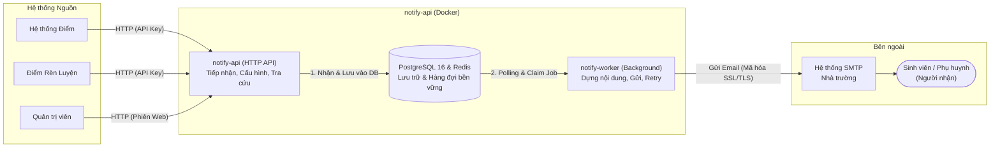
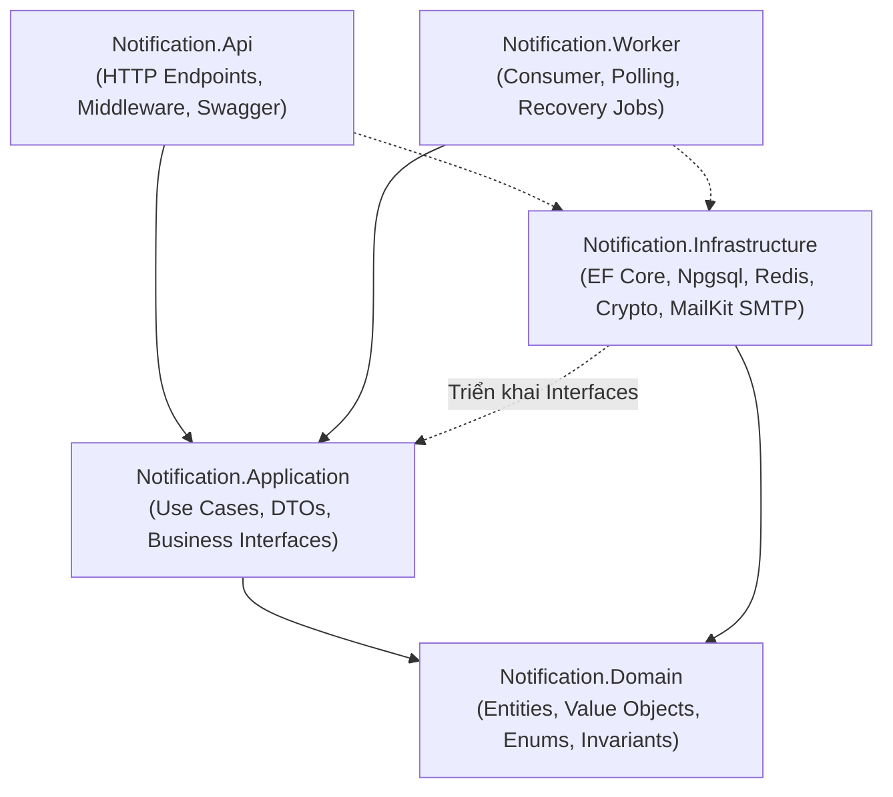
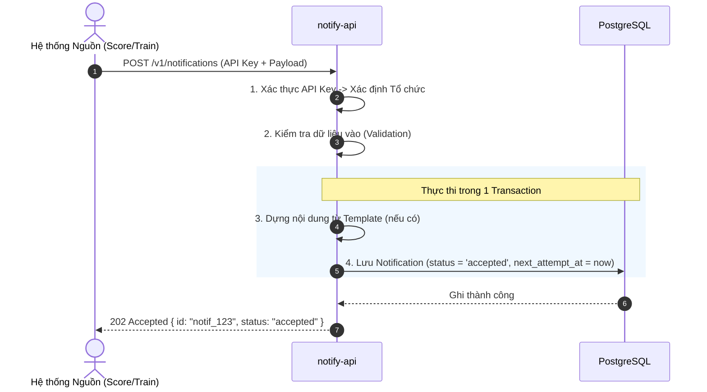
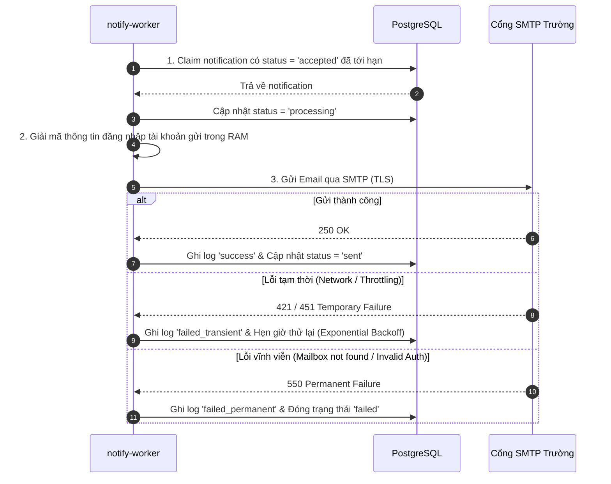

# Kiến trúc Hệ thống (System Architecture)

> **Dự án:** Notification Server (`notify-api`)  
> **Tài liệu liên quan:** [PRODUCT.md](PRODUCT.md) · [SPECS.md](SPECS.md) · [CONVENTIONS.md](CONVENTIONS.md) · [WORKFLOW.md](WORKFLOW.md) · [TROUBLESHOOTING.md](TROUBLESHOOTING.md)

Tài liệu này quyết định cấu trúc, ranh giới và cơ chế. Nó không định nghĩa endpoint, thân yêu cầu hay cột dữ liệu — những thứ đó thuộc `SPECS.md`.

---

## 1. Bối cảnh Hệ thống (System Overview)

Dịch vụ `notify-api` là hệ thống gửi thông báo độc lập, nhận yêu cầu từ các hệ thống trường học và gửi email an toàn qua SMTP của nhà trường.

Hai đơn vị triển khai, một mã nguồn, một cơ sở dữ liệu. Không dùng chung gì với dịch vụ CDN/Media: repository riêng, cơ sở dữ liệu riêng, định danh riêng.

---

## 2. Các quyết định Kiến trúc (Architectural Decisions)

| # | Quyết định | Lý do | Phương án bị loại |
|---|---|---|---|
| **D1** | Dịch vụ độc lập, không phải module của cdn-api | Bên gọi là các hệ thống khác; đường gửi thông báo không được dính vào nhịp triển khai của dịch vụ media | Thêm module `notification` vào cdn-api — nhanh hơn nhưng buộc chung bản phát hành và mô hình tenant |
| **D2** | Tenancy riêng, thông tin xác thực riêng, cơ sở dữ liệu riêng | Quyết định của người phụ trách sản phẩm; tenant của dịch vụ CDN không phải các hệ thống nguồn của trường | Dùng lại tenants/api_keys của cdn-api |
| **D3** | Tách `api` và `worker`; worker polling PostgreSQL | Nhận bền vững, gửi sau mà không thêm Redis queue ở phiên bản đầu | Gửi ngay trong request — vi phạm M3 và phụ thuộc nhà cung cấp |
| **D4** | PostgreSQL vừa là nguồn sự thật vừa là hàng đợi bền vững | Giảm thành phần và loại bỏ lỗi lệch trạng thái DB/queue; Redis chỉ dùng cho cache/rate limit khi cần | Dùng thêm queue trước khi lưu lượng thực tế yêu cầu |
| **D5** | Job chỉ mang mã thông báo | Nội dung có thể lớn và có thể đổi; worker đọc lại chính bản ghi nó sắp xử lý | Nhét toàn bộ nội dung vào job |
| **D6** | Mỗi lần gửi là một dòng bất biến (I12) | Chẩn đoán và kiểm toán cần mọi lần thử, không chỉ lần cuối | Ghi đè một trường trạng thái |
| **D7** | Truy cập nhà cung cấp qua một cổng hẹp `EmailSender` | Nhà cung cấp thứ hai (S-05) và kênh sau này không được chạm vào intake | Gọi thẳng thư viện SMTP trong logic gửi |
| **D8** | Bí mật của tài khoản gửi mã hoá bằng khoá ứng dụng, không bao giờ trả ra (I4) | Dịch vụ giữ thông tin đăng nhập mail thật của trường | Lưu dạng thô và trông vào phân quyền cơ sở dữ liệu |
| **D9** | Nội dung đi kèm yêu cầu; mẫu nội dung là tuỳ chọn | Quyết định sản phẩm: hệ thống nguồn tự gửi tiêu đề và nội dung | Bắt buộc dùng mẫu |
| **D10**| ASP.NET Core API + .NET Worker, EF Core/Npgsql, PostgreSQL và Redis; đóng gói Docker, vẫn dùng Compose/Nginx hiện có | Phù hợp hệ thống backend/worker dài hạn; type system, DI, hosted service và observability thống nhất; dịch vụ vốn độc lập nên không cần chung runtime với CDN | Node/Fastify cho phép chung toolchain với CDN nhưng không tạo lợi ích chia sẻ dữ liệu hay deployment |

---

## 3. Các Tiến trình (Processes)

### 3.1. `api` — Bề mặt vào duy nhất
HTTP không giữ trạng thái. Trách nhiệm: xác thực, phân quyền trong phạm vi một tổ chức, kiểm tra dữ liệu và đọc ghi Postgres. Nó không nói chuyện với nhà cung cấp mail, trừ một ngoại lệ: thư thử (M-05) gửi đồng bộ, vì quản trị viên đang chờ câu trả lời.

### 3.2. `worker` — Xử lý ngầm & Chống lỗi
Polling và claim notification tới hạn trong PostgreSQL. Trách nhiệm: nạp thông báo, dựng nội dung nếu có gọi tên mẫu, gọi cổng gửi, ghi dòng kết quả lần gửi, quyết định thử lại hay từ bỏ. Không mở HTTP ngoài endpoint health. Mở rộng theo chiều ngang là thêm worker; mức đồng thời mỗi worker có giới hạn để không dội vào nhà cung cấp.

---

## 4. Ranh giới Module trong Mã nguồn (Clean Architecture)

Dự án áp dụng mô hình Modular Monolith theo Clean Architecture:

### Quy tắc bất biến:
- Endpoint không gọi thẳng DbContext/repository; use case không gọi repository của module khác.
- `template` là thuần túy: cho câu chữ và dữ liệu thì trả về văn bản (không I/O).
- `sender` chỉ trả lời "cho tôi một tài khoản gửi dùng được của tổ chức này", không biết gì về thông báo.
- Chỉ Infrastructure cài đặt email adapter; Delivery chỉ phụ thuộc `IEmailSender` của Application.
- Mọi hàm repository đều nhận mã tổ chức và lọc theo nó — cô lập được ép ở tầng thấp nhất.

---

## 5. Quyền sở hữu Dữ liệu và Độ bền (Data Storage & Durability)

| Kho lưu trữ | Dữ liệu chứa | Yêu cầu về độ bền |
|---|---|---|
| **PostgreSQL** | Tổ chức, quản trị viên, API key, tài khoản gửi (mã hóa bí mật), mẫu nội dung, thông báo kèm nội dung và người nhận, nhật ký các lần gửi | Nguồn sự thật (Source of Truth); sao lưu và phục hồi là điều kiện hoàn tất MVP |
| **Redis** | Cache phiên làm việc và bộ đếm giới hạn tần suất (Rate Limiting) | Không nằm trên đường gửi cơ bản; mất Redis không làm mất notification |

---

## 6. Đường đi của một Thông báo (Notification Lifecycle Flow)

Quy trình xử lý thông báo được chia thành 2 pha hoàn toàn tách biệt:

### 6.1. Pha 1: Tiếp nhận Yêu cầu (Intake Flow - Đồng bộ)

### 6.2. Pha 2: Xuất bản & Chống lỗi (Delivery Flow - Bất đồng bộ)

---

## 7. An toàn & Bảo mật (Security Model)

- **Xác thực 2 lớp:**
  - Phiên của Quản trị viên: Token ngắn hạn.
  - API Key của Hệ thống máy: `notify_` + chuỗi ngẫu nhiên, lưu dạng băm (Hash), dùng tiền tố để tra cứu. Thu hồi có hiệu lực tức thì.
- **Mã hóa Bí mật Tài khoản:** Mật khẩu SMTP được mã hóa bằng AES-256 đối xứng với khóa từ biến môi trường, chỉ giải mã tạm thời trong RAM của `worker` lúc gửi, không bao giờ xuất hiện trong log hoặc API response.
- **Giới hạn Tần suất (Rate Limiting):** Áp dụng theo từng tổ chức và từng API key, lưu bộ đếm trong Redis để ngăn chặn tấn công spam hoặc quá tải SMTP.

---

## 8. Vận hành & Giám sát (Operations)

- **Health Check:** `GET /health` trên `api` và `worker` kiểm tra kết nối PostgreSQL và Redis.
- **Structured Logging:** Mỗi request mang một `CorrelationId` duy nhất từ lúc tiếp nhận đến từng lần gửi SMTP. Thân lỗi 5xx không bao giờ để lộ thông tin hạ tầng nội bộ.
- **Đóng gói Docker:** Khởi chạy bằng Docker Compose chung với Nginx Reverse Proxy.
