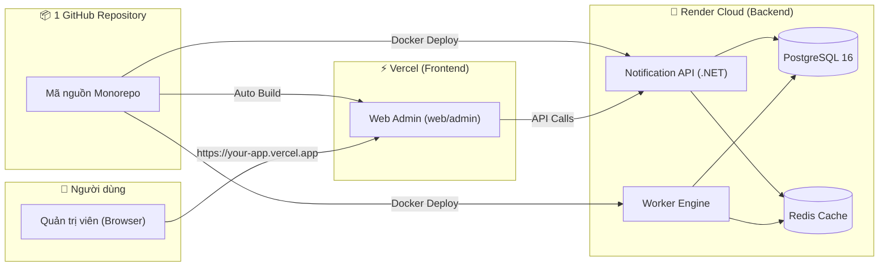

# Quy Trình Triển Khai Hệ Thống Chuẩn (Deployment Guide)

Tài liệu này hướng dẫn chi tiết quy trình triển khai toàn bộ hệ thống `notification-server` từ A đến Z theo mô hình **Monorepo** (1 GitHub Repo duy nhất):
- **Frontend (Web Admin Console)**: Triển khai trên **Vercel** (CDN toàn cầu, tự động cấp SSL HTTPS).
- **Backend (.NET API + Worker Engine)**: Triển khai trên **Render** (Container Docker).
- **Database Layer**: **PostgreSQL & Redis** trên Render (hoặc Supabase / Upstash).

---



---

## 📋 GIAI ĐOẠN 1: Push Code Lên 1 Repo GitHub Duy Nhất

1. Khởi tạo Git và đẩy toàn bộ dự án lên GitHub:
```powershell
# 1. Kiểm tra trạng thái và thêm toàn bộ file
git add .
git commit -m "feat: complete notification server and admin ui"

# 2. Đặt nhánh chính là main và push lên GitHub
git branch -M main
git remote add origin https://github.com/<tai-khoan-cua-ban>/notification-server.git
git push -u origin main
```

---

## 🗄️ GIAI ĐOẠN 2: Triển Khai Backend & CSDL Trên Render

### Bước 2.1: Tạo Database PostgreSQL trên Render
1. Vào [Render Dashboard](https://dashboard.render.com/) ➔ Bấm **New +** ➔ Chọn **PostgreSQL**.
2. **Name**: `notification-postgres`
3. **Database**: `notification`
4. **User**: `notify`
5. **Region**: Singapore (hoặc Oregon / Frankfurt).
6. Bấm **Create Database**.
7. Sau khi tạo xong, cuộn xuống mục **Connections** ➔ Copy giá trị **`Internal Database URL`** (hoặc `External Database URL`).

### Bước 2.2: Tạo Redis trên Render
1. Trên Render Dashboard ➔ Bấm **New +** ➔ Chọn **Redis**.
2. **Name**: `notification-redis`
3. Bấm **Create Redis Instance**.
4. Copy giá trị **`Internal Redis URL`**.

### Bước 2.3: Tạo Web Service Backend (.NET API)
1. Trên Render Dashboard ➔ Bấm **New +** ➔ Chọn **Web Service**.
2. Chọn repo GitHub `notification-server` của bạn.
3. Cấu hình cơ bản:
   - **Name**: `notification-api`
   - **Region**: Cùng khu vực với PostgreSQL & Redis vừa tạo.
   - **Language / Runtime**: **Docker** (Render sẽ tự động dùng `deploy/docker/Dockerfile`).
4. Cuộn xuống mục **Environment Variables** và điền đủ 5 biến bắt buộc:

| Tên biến (Key) | Giá trị mẫu (Value) | Giải thích |
|---|---|---|
| **`DATABASE_URL`** | *(Dán `Internal Database URL` từ Bước 2.1)* | Kết nối PostgreSQL |
| **`REDIS_URL`** | *(Dán `Internal Redis URL` từ Bước 2.2)* | Kết nối Redis |
| **`ENCRYPTION_KEY`** | `MDEyMzQ1Njc4OTAxMjM0NTY3ODkwMTIzNDU2Nzg5MDE=` | Khóa mã hóa token Base64 32 bytes |
| **`JWT_SECRET`** | `c1f4e723908dbab68c17b5e4089a87d002f1a9b43e871234567890abcdef1234` | Khóa ký JWT (tối thiểu 32 ký tự) |
| **`API_KEY_SALT`** | `8a9b1234cdef567890abcdef12345678` | Salt băm API Key (tối thiểu 16 ký tự) |

5. Bấm **Create Web Service**.
6. Đợi Render build xong, bạn sẽ nhận được URL Backend (Ví dụ: `https://notification-len1.onrender.com`).

---

## 💻 GIAI ĐOẠN 3: Triển Khai Frontend Trên Vercel

1. Đăng nhập vào [Vercel](https://vercel.com/) ➔ Bấm **Add New...** ➔ Chọn **Project**.
2. Bấm **Import** vào repo GitHub `notification-server`.
3. **Cấu hình Thư mục gốc (Bắt buộc)**:
   - Tại mục **Root Directory**, bấm nút **Edit** ➔ Chọn thư mục: `web/admin` ➔ Bấm **Continue**.
   - Mục **Framework Preset**: Vercel sẽ tự động nhận diện là **Vite**.
4. **Cấu hình Biến Môi Trường (Environment Variables)**:
   - Mở mục **Environment Variables**:
     - **Key**: `VITE_API_URL`
     - **Value**: `https://notification-len1.onrender.com` *(Chỉ điền URL sạch, không có dấu ngoặc hay markdown)*.
5. Bấm **Deploy**.
6. Đợi 30 giây, Vercel sẽ cấp link truy cập Web Admin (Ví dụ: `https://notification-xxx.vercel.app`).

---

## 👑 GIAI ĐOẠN 4: Khởi Tạo Tổ Chức & Admin Đầu Tiên

1. Mở link Web Admin trên Vercel: `https://notification-xxx.vercel.app/login`
2. Bấm vào dòng chữ **"Chưa có tài khoản? Đăng ký tổ chức mới"**.
3. Điền thông tin khởi tạo:
   - **Tên tổ chức**: Ví dụ `Citad Organization`
   - **Slug tổ chức**: Ví dụ `citad-org`
   - **Email Admin**: Ví dụ `admin@citad.vn`
   - **Mật khẩu**: Ví dụ `Admin@Citad2026!` (tối thiểu 8 ký tự).
4. Bấm **"Đăng ký & Đăng nhập"**.

🎉 **Hệ thống sẽ tự động khởi tạo CSDL, phân quyền Owner và đưa bạn trực tiếp vào Dashboard quản trị!**

---

## 🔄 GIAI ĐOẠN 5: Quy Trình Cập Nhật Code Sau Này (CI/CD)

Khi bạn sửa đổi code (dù là Backend hay Frontend):
1. Bạn chỉ cần commit và push lên GitHub:
   ```powershell
   git add .
   git commit -m "feat: your new feature"
   git push
   ```
2. **Tự động hóa hoàn toàn**:
   - **Vercel** sẽ tự động phát hiện thay đổi trong `web/admin` và cập nhật giao diện trong ~20 giây.
   - **Render** sẽ tự động build lại Docker image và cập nhật API Backend mà không bị gián đoạn (Zero-downtime).
