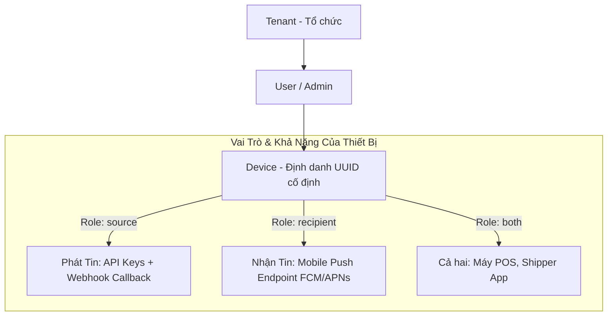
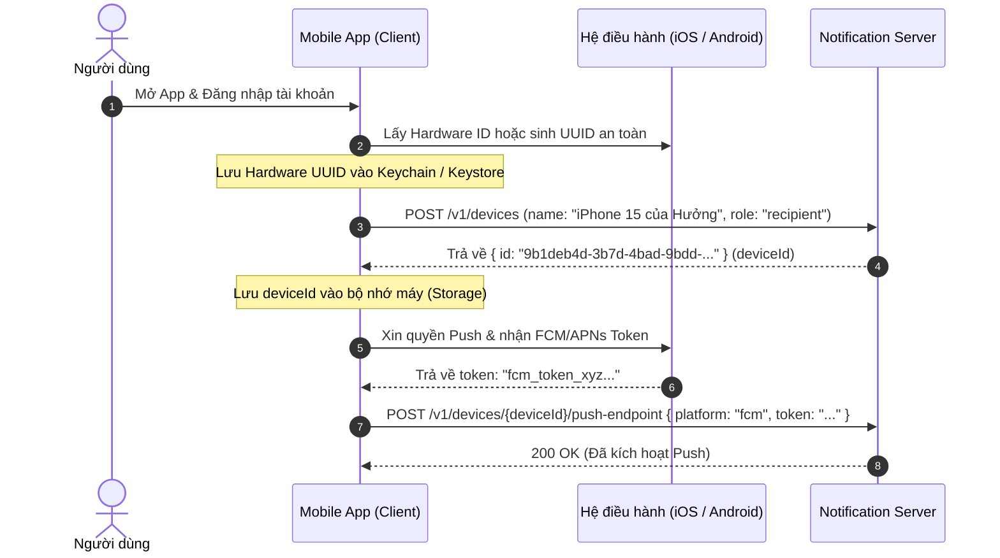

# DEVICE-001 — Quản Trị Thiết Bị, Khóa API, Push Endpoint & Webhook Callback

Status: Verified  
Module: `08-devices`  
Dependencies: `AUTH-001`  
Subsumes: `DEVICE-002`, `CBACK-001`, `AUTH-003`

---

## 1. Kiến Trúc Thiết Bị & Bản Chất Thực Tế

Trong mô hình thông báo đa kênh, thực thể **Device (Thiết bị)** là danh tính ổn định đại diện cho cả **hệ thống phát tin** lẫn **thiết bị nhận tin**.



### 1.1. Tại Sao Thiết Bị Lại Chia Ra Các Vai Trò (`source`, `recipient`, `both`)?
Docs hệ thống phân chia rõ ràng 3 vai trò nhằm tuân thủ **Nguyên tắc phân quyền tối thiểu (Least Privilege)** và tách biệt ranh giới bảo mật:

1. **`source` (Hệ thống Nguồn - Máy phát tin)**:
   - **Thực tế**: Là các máy chủ Backend, Microservices (như `Order-Service`, `Auth-Service`, `Website-Checkout`).
   - **Đặc điểm**: Cần **API Key** để đẩy thông báo vào hàng đợi (`POST /v1/notifications`), và cần **Webhook Callback** để nhận báo cáo trạng thái sau khi Worker hoàn thành.
   - **Bảo mật**: Tuyệt đối **không nhận Push Notification** và không có push token.
2. **`recipient` (Thiết bị Đích - Người nhận tin)**:
   - **Thực tế**: Là chiếc điện thoại di động (iPhone / Android) của người dùng cuối hoặc nhân viên.
   - **Đặc điểm**: Đăng ký **Push Token (FCM / APNs)** với server để chờ nhận thông báo nổi (Pop-up) trên màn hình khóa.
   - **Bảo mật**: **Tuyệt đối KHÔNG được cấp API Key**. Nếu cấp API Key cho app di động, kẻ xấu có thể decompile/dịch ngược file APK/IPA, lấy cắp API Key và biến hệ thống của bạn thành công cụ spam tin nhắn rác.
3. **`both` (Cả hai vai trò)**:
   - **Thực tế**: Dành cho các thiết bị nghiệp vụ chuyên dụng vừa phát sinh yêu cầu vừa nhận tin: ví dụ **Máy POS bán hàng**, **Ứng dụng của Shipper/Tài xế** (vừa nhận thông báo có đơn hàng mới cần giao, vừa bấm xác nhận hoàn thành đơn hàng để hệ thống gửi thông báo cho khách).

---

### 1.2. Mobile Push Endpoint (FCM / APNs) Dùng Để Làm Gì Trong Thực Tế?
* **Mục đích**: Làm rung chuông, sáng màn hình và hiển thị thông báo biểu ngữ (banner/pop-up) trên điện thoại iOS/Android của người dùng ngay cả khi họ đã tắt ứng dụng.
* **Cơ chế**:
  - Hệ điều hành Apple (APNs) hoặc Google (FCM) cấp một chuỗi `Push Token` ngẫu nhiên cho ứng dụng di động.
  - Ứng dụng gửi token này lên `notification-server`. Server mã hóa token bằng thuật toán **`AES-256-GCM`** trước khi lưu vào CSDL.
  - Khi gửi thông báo, người gửi chỉ cần chỉ định `target: "<deviceId>"` (không cần biết raw token của Google/Apple). Worker sẽ tự động giải mã và gọi Apple/Google đẩy tin đến điện thoại.
  - Nếu Google/Apple phản hồi token đã hết hạn (`404 Not Found` hoặc `410 Unregistered`), Worker tự động chuyển trạng thái push endpoint sang `disabled` để tránh gửi lặp vô ích.

---

### 1.3. Webhook Callback (HMAC) Dùng Để Làm Gì Trong Thực Tế?
* **Mục đích**: Báo cáo kết quả gửi tin ngược về cho hệ thống nguồn theo cơ chế **Bất đồng bộ (Asynchronous)**.
* **Bài toán thực tế**:
  - Khi Website gọi API gửi 5.000 email xác nhận vé máy bay, nếu website phải chờ 5.000 email gửi xong mới phản hồi thì trình duyệt của khách sẽ bị treo (timeout).
  - Vì vậy, API trả về ngay mã `202 Accepted` trong 30ms. Quá trình gửi email thật do Worker chạy ngầm (mất vài giây).
  - Khi gửi xong (thành công hoặc thất bại), Worker sẽ tự động gửi một gói tin HTTP POST ngược lại URL của website bán hàng (Webhook Callback) để thông báo: *"Email đơn hàng #123 đã gửi thành công lúc 10:05"*.
* **Chữ ký số HMAC-SHA256**:
  - Gói tin callback được đính kèm Header: `X-Signature-SHA256: <hex-hash>`.
  - Website bán hàng dùng Secret đã được cấp để kiểm tra chữ ký. Nhờ đó, website chắc chắn 100% gói tin này là do `notification-server` gửi đến, phòng chống triệt để tấn công giả mạo kết quả (Tampering / Man-in-the-middle).

---

### 1.4. Trong Thực Tế: Khi Thiết Bị Đăng Nhập Trên Mobile, Làm Sao Xác Định Được ID Thiết Bị Đó?
Đây là quy trình chuẩn 4 bước được triển khai trong mọi ứng dụng Mobile thực tế (React Native, Flutter, iOS Swift, Android Kotlin):



1. **Sinh ID thiết bị duy nhất trên máy**:
   - Khi App được mở lần đầu, App dùng thư viện hệ điều hành (ví dụ: `react-native-device-info`, iOS `identifierForVendor`, Android `ANDROID_ID`) hoặc tự sinh một UUID ngẫu nhiên.
   - App lưu ID này vào vùng nhớ bảo mật không bị xoá khi cập nhật app (**iOS Keychain** hoặc **Android EncryptedSharedPreferences**).
2. **Đăng ký thiết bị với Server**:
   - Sau khi user đăng nhập, App gọi `POST /v1/devices` với tên điện thoại và nhận về mã `deviceId` (UUID cố định).
3. **Đăng ký Push Token**:
   - App nhận push token từ Apple/Google và gọi `POST /v1/devices/{deviceId}/push-endpoint` để liên kết token với thiết bị.
4. **Về sau**: Bất kỳ khi nào backend muốn bắn thông báo đến chiếc điện thoại này, backend chỉ cần gọi tới `target: "<deviceId>"`.

---

### 1.5. Hướng Dẫn Kiểm Thử (Test) Ngay Mà Không Cần Viết Ứng Dụng Mobile

#### A. Cách Test Webhook Callback (HMAC) Bằng `webhook.site`:
1. Mở trình duyệt truy cập: **[https://webhook.site](https://webhook.site)**.
2. Sao chép đường link URL tạm thời (ví dụ: `https://webhook.site/08c34f9a-1122-4433-8899-aabbccddeeff`).
3. Trên giao diện Web Admin:
   - Vào menu **Thiết bị & Keys** (`/devices`) → Chọn thiết bị của bạn.
   - Tại mục **Callback webhook**, dán URL của `webhook.site` vào → Bấm **Cấu hình Callback**.
   - Hệ thống sinh ra một mã `HMAC Secret` (lưu mã này).
4. Dùng API Key của thiết bị đó gửi một thông báo bất kỳ.
5. Quay lại trang `webhook.site`:
   - Gói tin callback `notification.completed` sẽ nổ về ngay lập tức.
   - Xem tab Headers: Có `X-Signature-SHA256` và `X-Event-ID`.
   - Xem tab Body: Có `notificationId`, `status: "delivered"` và timestamp.

#### B. Cách Test Push Endpoint (FCM / APNs):
1. Vào **Thiết bị & Keys** (`/devices`) → Bấm **Thêm thiết bị** với vai trò `recipient` (hoặc `both`).
2. Mở chi tiết thiết bị, kéo xuống mục **Cấu hình Push Notification (FCM / APNs)**:
   - Chọn Platform: `fcm`.
   - Điền Mock Token thử nghiệm: `fcm_test_token_abc123xyz_demo`.
   - Bấm **Đăng ký Push Token**.
3. **Xác nhận kết quả**:
   - Giao diện báo thành công, trạng thái hiển thị `Đang hoạt động`.
   - Token được mã hóa bảo mật trong CSDL và không bị lộ ra ngoài màn hình.
   - Bấm **Hủy Push Token** để kiểm tra tính năng xóa/thu hồi endpoint.

---

## 2. Toàn Bộ Đặc Tả CRUD Chi Tiết

### 2.1. CRUD Thiết Bị (Devices)

#### [CREATE] Đăng ký thiết bị mới
* **Endpoint**: `POST /v1/devices`
* **Quyền**: Bearer User/Admin JWT
* **Request Body**:
  ```json
  {
    "name": "Backend Order Service",
    "role": "source"
  }
  ```
  *(Các giá trị `role` hợp lệ: `source`, `recipient`, `both`)*.
* **Validation**:
  - `name`: 2 - 100 ký tự, không chứa ký tự điều khiển.
  - `role`: Bắt buộc là `source`, `recipient`, hoặc `both`.
* **Response (201 Created)**:
  ```json
  {
    "id": "3fa85f64-5717-4562-b3fc-2c963f66afa6",
    "name": "Backend Order Service",
    "role": "source",
    "status": "active",
    "callbackConfigured": false,
    "activeKeyCount": 0,
    "createdAt": "2026-09-04T10:00:00Z",
    "updatedAt": "2026-09-04T10:00:00Z"
  }
  ```

#### [READ] Danh sách thiết bị
* **Endpoint**: `GET /v1/devices?scope=mine&status=active&limit=20&cursor=<token>`
* **Quyền**: Bearer User/Admin JWT
* **Query Params**:
  - `scope`: `mine` (chỉ thiết bị do mình tạo) hoặc `tenant` (toàn bộ thiết bị trong tổ chức).
  - `status`: `active` hoặc `disabled`.
* **Response (200 OK)**:
  ```json
  {
    "items": [
      {
        "id": "3fa85f64-5717-4562-b3fc-2c963f66afa6",
        "name": "Backend Order Service",
        "role": "source",
        "status": "active",
        "callbackConfigured": true,
        "activeKeyCount": 2,
        "createdAt": "2026-09-04T10:00:00Z",
        "updatedAt": "2026-09-04T10:00:00Z"
      }
    ],
    "nextCursor": "ZXlKaGJHY2lPaUpTVX...=="
  }
  ```

#### [READ] Chi tiết thiết bị
* **Endpoint**: `GET /v1/devices/{id}`
* **Response (200 OK)**: Trả về đối tượng `DeviceItem` đầy đủ.

#### [UPDATE] Đổi tên thiết bị
* **Endpoint**: `PATCH /v1/devices/{id}`
* **Request Body**:
  ```json
  {
    "name": "Backend Payment Service (Updated)"
  }
  ```
* **Lưu ý**: `role` của thiết bị là bất biến sau khi tạo để bảo vệ tính toàn vẹn bảo mật.

#### [DELETE / DISABLE] Vô hiệu hóa thiết bị
* **Endpoint**: `POST /v1/devices/{id}/disable`
* **Response (204 No Content)**
* **Hành vi nghiệp vụ (Security Impact)**:
  - Thao tác này là Idempotent (gọi nhiều lần kết quả như nhau).
  - **Lập tức vô hiệu hóa toàn bộ API Key** thuộc thiết bị này. Mọi request tiếp theo bằng các API Key này sẽ bị từ chối `401 Unauthorized`.

---

### 2.2. CRUD Khóa API (API Keys của Device)

#### [CREATE] Sinh API Key mới cho thiết bị
* **Endpoint**: `POST /v1/devices/{id}/api-keys`
* **Response (201 Created)**:
  ```json
  {
    "id": "e4eaaaf2-d142-11e1-b3e4-080027620cdd",
    "deviceId": "3fa85f64-5717-4562-b3fc-2c963f66afa6",
    "keyPrefix": "notify_a1b2c3d4e5f6",
    "key": "notify_a1b2c3d4e5f60718293a4b5c6d7e8f90123456789abcdef0123456789abcdef0",
    "status": "active",
    "createdAt": "2026-09-04T10:00:00Z"
  }
  ```
  *(Chuỗi `key` bí mật chỉ trả về duy nhất một lần này, sau đó được băm bằng salt và không thể đọc ngược)*.

#### [READ] Liệt kê API Keys của thiết bị
* **Endpoint**: `GET /v1/devices/{id}/api-keys`
* **Response (200 OK)**:
  ```json
  {
    "items": [
      {
        "id": "e4eaaaf2-d142-11e1-b3e4-080027620cdd",
        "keyPrefix": "notify_a1b2c3d4e5f6",
        "status": "active",
        "createdAt": "2026-09-04T10:00:00Z"
      }
    ]
  }
  ```
  *(Tuyệt đối không lộ raw key hoặc keyHash)*.

#### [DELETE / REVOKE] Thu hồi API Key
* **Endpoint**: `DELETE /v1/devices/{id}/api-keys/{keyId}`
* **Response (204 No Content)**: Khóa chuyển trạng thái sang `revoked` và mất quyền gọi API vĩnh viễn.

---

### 2.3. CRUD Webhook Callback (HMAC)

#### [UPSERT] Cấu hình Webhook URL & Sinh HMAC Secret
* **Endpoint**: `PUT /v1/devices/{id}/callback`
* **Request Body**:
  ```json
  {
    "url": "https://source.example.edu.vn/api/notification-callback"
  }
  ```
* **Validation**:
  - URL bắt buộc dùng `https://` trên production (chặn dải IP nội bộ và SSRF).
* **Response (200 OK)**:
  ```json
  {
    "url": "https://source.example.edu.vn/api/notification-callback",
    "secret": "b3BlbnNzbC1yYW5kLWJhc2U2NC1zZWNyZXQtaG1hYw=="
  }
  ```
  *(Chuỗi `secret` HMAC chỉ trả về một lần để lưu trữ vào hệ thống của bạn)*.

#### [FORMAT] Đặc tả gói tin Callback gửi về nguồn
* **Headers**:
  - `Content-Type: application/json`
  - `X-Event-ID: evt_xxxxxxxx...`
  - `X-Signature-SHA256: <HMAC_SHA256(secret, timestamp + "." + rawBody)>`
* **Payload**:
  ```json
  {
    "eventId": "evt_xxxxxxxx...",
    "schemaVersion": 1,
    "type": "notification.completed",
    "notificationId": "notif_xxxx...",
    "status": "delivered",
    "finishedAt": "2026-09-04T10:05:00Z"
  }
  ```

---

### 2.4. CRUD Push Endpoint (iOS / Android)

#### [CREATE / ROTATE] Đăng ký hoặc Xoay vòng Push Token
* **Endpoint**: `POST /v1/devices/{id}/push-endpoint`
* **Request Body**:
  ```json
  {
    "platform": "fcm",
    "token": "fcm_registration_token_day_du_tu_google..."
  }
  ```
  *(Hỗ trợ `platform`: `fcm` hoặc `apns`)*.
* **Security**: Token được mã hóa bảo mật `AES-256-GCM` trong database.
* **Response (200 OK)**: Trả về thông tin trạng thái `active`, không trả raw token.

#### [READ] Xem Push Endpoint của thiết bị
* **Endpoint**: `GET /v1/devices/{id}/push-endpoint`
* **Response (200 OK)**:
  ```json
  {
    "deviceId": "3fa85f64-5717-4562-b3fc-2c963f66afa6",
    "platform": "fcm",
    "status": "active",
    "createdAt": "2026-09-04T10:00:00Z",
    "updatedAt": "2026-09-04T10:00:00Z",
    "lastDeliveredAt": null
  }
  ```

#### [DELETE] Hủy đăng ký Push Endpoint
* **Endpoint**: `DELETE /v1/devices/{id}/push-endpoint`
* **Response (204 No Content)**: Token bị xóa hoặc chuyển sang `disabled`.
