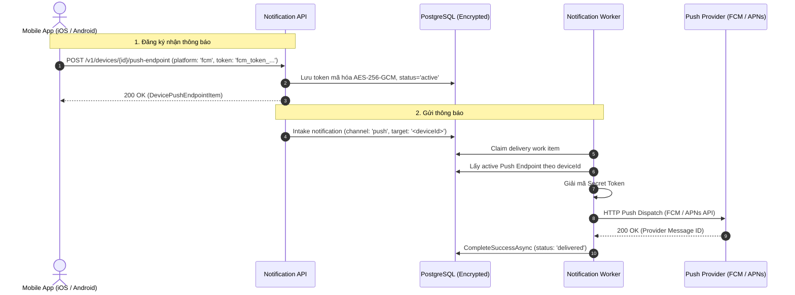

# DEVICE-002 — Push Endpoint iOS và Android

Status: Verified
Dependencies: AUTH-004, DEVICE-001, CHAN-001

## 1. Mô tả tổng quan

User và thiết bị di động (Mobile App iOS/Android) đăng ký thiết bị nhận với `deviceId` (UUID ổn định). Mỗi thiết bị lưu trữ một push endpoint (FCM hoặc APNs) với push device token được mã hóa an toàn (`AES-256-GCM`). 

Hệ thống nguồn hoặc Admin khi gửi thông báo kênh `push` chỉ cần chỉ định `target: "<deviceId>"` (không cần biết và không truyền raw push token). Server tự giải mã token và thực hiện dispatch tới FCM/APNs.

---

## 2. Thông số kỹ thuật

### Endpoints
- `POST /v1/devices/{id}/push-endpoint`: Đăng ký hoặc xoay vòng (rotate) Push Token (`platform`: `fcm` | `apns`, `token`: string).
- `GET /v1/devices/{id}/push-endpoint`: Lấy thông tin push endpoint của thiết bị (chỉ trả về `platform`, `status`, `createdAt`, `updatedAt`, `lastDeliveredAt` — tuyệt đối không trả raw token).
- `DELETE /v1/devices/{id}/push-endpoint`: Vô hiệu hóa (revoke) push endpoint.
- `POST /v1/notifications`: Hỗ trợ `channel.type: "push"` với `target.address` là GUID của thiết bị nhận.

### Xử lý lỗi nhà cung cấp (FCM / APNs Error Classification)
- **Token không hợp lệ / Hết hạn (`400 BadDeviceToken`, `404 Not Found`, `410 Gone / Unregistered`)**:
  - Ghi nhận `permanent_failure` (`PUSH_TOKEN_INVALID`).
  - Worker tự động cập nhật `status: 'disabled'` cho push endpoint tương ứng trong CSDL để tránh gửi lặp vô ích.
- **Rate Limit (`429 Too Many Requests`)**:
  - Ghi nhận `transient_failure` (`PUSH_RATE_LIMITED`) và áp dụng retry backoff (1m -> 5m -> 25m).
- **Lỗi máy chủ Provider (`5xx Server Error`)**:
  - Ghi nhận `transient_failure` (`PUSH_SERVER_UNAVAILABLE`) và thử lại.

---

## 3. Các thành phần đã triển khai

1. **Domain Layer**:
   - `DeviceRole.Recipient` (`"recipient"`) được công nhận hợp lệ trong [Device.cs](file:///d:/Workspace/Citad/notification-server/src/Notification.Domain/Devices/Device.cs).
   - [DevicePushEndpoint.cs](file:///d:/Workspace/Citad/notification-server/src/Notification.Domain/Devices/DevicePushEndpoint.cs) entity quản lý token mã hóa, platform, và trạng thái.
2. **Infrastructure & Persistence**:
   - Migration `AddDevicePushEndpoints` tạo bảng `device_push_endpoints` với unique index `(tenant_id, device_id)`.
   - [PushChannelSender.cs](file:///d:/Workspace/Citad/notification-server/src/Notification.Infrastructure/Channels/Push/PushChannelSender.cs) tích hợp HTTP client chuẩn hóa cho FCM và APNs.
   - [DeviceRepository.cs](file:///d:/Workspace/Citad/notification-server/src/Notification.Infrastructure/Persistence/DeviceRepository.cs) bổ sung tìm kiếm và cập nhật push endpoint.
3. **Application & API Layer**:
   - [PushEndpointHandlers.cs](file:///d:/Workspace/Citad/notification-server/src/Notification.Application/Devices/PushEndpointHandlers.cs) xử lý đăng ký, mã hóa và hủy push token.
   - [DeliverNotificationHandler.cs](file:///d:/Workspace/Citad/notification-server/src/Notification.Application/Notifications/Delivery/DeliverNotificationHandler.cs) tích hợp kênh `push`, tự động giải mã token theo `targetDeviceId` và xử lý vô hiệu hóa khi token chết.
   - [DeviceEndpoints.cs](file:///d:/Workspace/Citad/notification-server/src/Notification.Api/Endpoints/Devices/DeviceEndpoints.cs) mở các API quản lý push endpoint.
   - [NotificationEndpoints.cs](file:///d:/Workspace/Citad/notification-server/src/Notification.Api/Endpoints/Notifications/NotificationEndpoints.cs) và [NotificationRequests.cs](file:///d:/Workspace/Citad/notification-server/src/Notification.Api/Contracts/Notifications/NotificationRequests.cs) mở kênh `push`.
4. **Admin Console (`web/admin`)**:
   - Quản lý Push Endpoint trực quan trong trang chi tiết thiết bị [Devices.tsx](file:///d:/Workspace/Citad/notification-server/web/admin/src/devices/Devices.tsx).
   - Bộ lọc và **Dispatch Playground** hỗ trợ kênh `📱 Push Mobile` trong [NotificationList.tsx](file:///d:/Workspace/Citad/notification-server/web/admin/src/notifications/NotificationList.tsx).

---

## 4. Bằng chứng kiểm thử

- **139/139 unit & integration tests** trong .NET passed 100%:
  - `DevicePushEndpointTests`: Kiểm thử khởi tạo, xác thực platform `fcm`/`apns`, xoay vòng token, vô hiệu hóa.
  - `PushChannelSenderTests`: Kiểm thử phân loại HTTP status codes từ FCM và APNs.
  - `PushEndpointHandlersTests`: Kiểm thử mã hóa token `AES-256-GCM` và lưu trữ.
  - `DeliverNotificationHandlerTests`: Kiểm thử dispatch kênh `push` và tự động disable push endpoint khi gặp `PUSH_TOKEN_INVALID`.
- **Frontend test suite** (Vitest) và **Production build** (`npm run build`) passed 100%.
