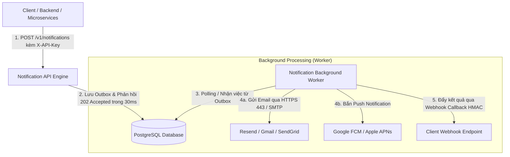
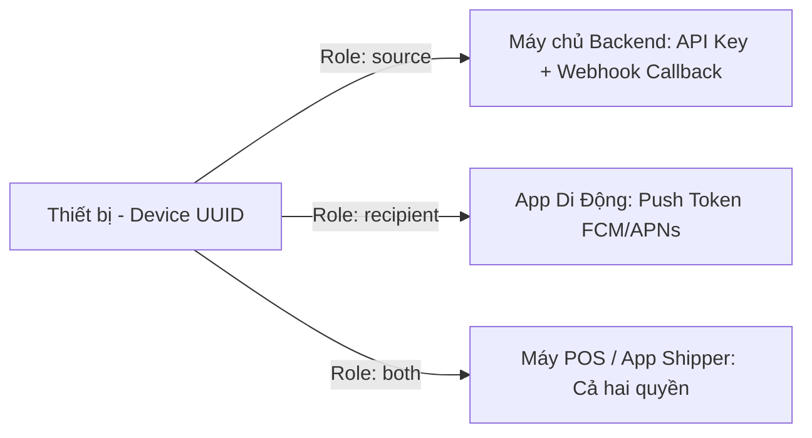
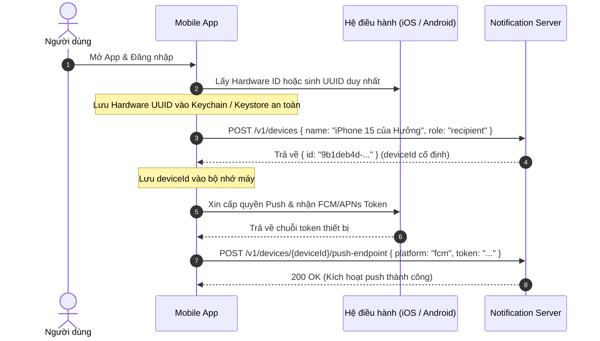

# Cẩm Nang Kiến Thức & Kiến Trúc Dự Án (Knowledge Base)

> **Dự án**: `notification-server` — Hệ thống Phân Phối Thông Báo Đa Kênh Tập Trung (Email, Mobile Push, Webhook Callback)  
> **Kiến trúc**: .NET 10 Clean Architecture, PostgreSQL, React 19 Admin SPA, Multi-Tenancy  
> **Mục đích tài liệu**: Lưu trữ toàn bộ kiến thức nghiệp vụ, quyết định kiến trúc cốt lõi, kinh nghiệm xử lý hạ tầng Cloud và cẩm nang kiểm thử thực chiến.

---

## 1. Tổng Quan Kiến Trúc Hệ Thống (High-Level Architecture)

`notification-server` được thiết kế theo mô hình **Bất đồng bộ hướng sự kiện (Asynchronous Event-Driven Architecture)** nhằm phục vụ hàng triệu thông báo mà không làm nghẽn hệ thống nguồn:



### Tại sao API phải trả về `202 Accepted` thay vì chờ gửi xong?
- **Tránh Timeout**: Nếu một đơn hàng cần gửi 5.000 email, việc chờ gửi xong mới trả về HTTP response sẽ khiến trình duyệt của khách hàng bị quay đơ (timeout 30s).
- **Phân tách trách nhiệm (Decoupling)**: Hệ thống nguồn chỉ cần đảm bảo tin nhắn đã được ghi nhận an toàn vào hàng đợi (`202 Accepted`). Việc kết nối với nhà mạng, thử lại khi rớt mạng (Exponential Backoff Retry) là nhiệm vụ của Worker chạy ngầm.

---

## 2. Kiến Trúc Thiết Bị & Phân Quyền Bảo Mật (Device Roles)

Một trong những thiết kế quan trọng nhất của hệ thống là thực thể **Device (Thiết bị)**. Thiết bị đại diện cho cả **hệ thống phát tin** lẫn **thiết bị nhận tin**.



### 2.1. Tại sao phải phân chia 3 vai trò (`source`, `recipient`, `both`)?
Tuân thủ tuyệt đối **Nguyên tắc phân quyền tối thiểu (Principle of Least Privilege)**:

1. **`source` (Hệ thống Nguồn - Máy phát tin)**:
   - **Thực tế**: Là các cụm máy chủ Backend, Microservices (như `Order-Service`, `Billing-Service`, `Website-Checkout`).
   - **Khả năng**: Được cấp **API Key** để đẩy thông báo vào hàng đợi (`POST /v1/notifications`), và được cấu hình **Webhook Callback** để nhận báo cáo trạng thái hoàn thành.
   - **Bảo mật**: Tuyệt đối **không nhận Push Notification** và không đăng ký push token.

2. **`recipient` (Thiết bị Đích - Người nhận tin)**:
   - **Thực tế**: Là điện thoại cá nhân (iPhone / Android) của người dùng cuối hoặc nhân viên.
   - **Khả năng**: Đăng ký **Push Token (FCM / APNs)** với server để nhận thông báo nổi trên màn hình khóa.
   - **Bảo mật tối quan trọng**: **TUYỆT ĐỐI KHÔNG CẤP API KEY CHO APP DI ĐỘNG**. Nếu cấp API Key gắn vào app mobile, tin tặc có thể decompile (dịch ngược file APK/IPA), lấy cắp API Key và biến server thành công cụ spam tin nhắn rác.

3. **`both` (Cả hai vai trò - Thiết bị hai chiều)**:
   - **Thực tế**: Dành cho thiết bị chuyên dụng vừa nhận việc vừa báo cáo kết quả: ví dụ **Máy POS bán hàng**, **Ứng dụng của Shipper / Tài xế** (vừa nhận cuốc xe mới qua Push, vừa bấm hoàn thành đơn để gọi API báo hệ thống gửi tin cho khách).

---

## 3. Bản Chất Của Mobile Push Endpoint & Webhook Callback (HMAC)

### 3.1. Mobile Push Endpoint (FCM / APNs) Hoạt Động Như Thế Nào?
- **Bản chất**: Cho phép server đánh thức điện thoại, làm rung chuông và hiện pop-up ngay cả khi người dùng đã tắt hoàn toàn ứng dụng (killed app).
- **Luồng dữ liệu**:
  1. Điện thoại khởi động -> Xin Apple (APNs) hoặc Google (FCM) cấp một chuỗi `Push Token`.
  2. App gửi token này lên server: `POST /v1/devices/{deviceId}/push-endpoint`.
  3. Server mã hóa token bằng chuẩn quân sự **`AES-256-GCM`** trước khi lưu vào CSDL.
  4. Khi gửi thông báo, người gửi chỉ cần chỉ định `target: "<deviceId>"`. Worker tự động giải mã token và gọi Google/Apple chuyển tiếp tin tới điện thoại.

### 3.2. Webhook Callback (HMAC) Dùng Để Làm Gì?
- **Bản chất**: Báo cáo kết quả gửi tin ngược về cho hệ thống nguồn theo cơ chế bất đồng bộ (Asynchronous Callback).
- **Chữ ký số chống giả mạo (HMAC-SHA256)**:
  - Khi gửi callback về URL của bạn, server đính kèm Header: `X-Signature-SHA256: <hex-hash>`.
  - Hệ thống nguồn dùng mã `HMAC Secret` đã lưu để tính hash payload và so sánh với header này.
  - **Lợi ích**: Đảm bảo 100% gói tin này xuất phát từ chính `notification-server`, loại trừ hoàn toàn nguy cơ kẻ xấu tấn công giả mạo trạng thái (Man-in-the-middle / Tampering).

---

## 4. Kinh Nghiệm Thực Chiến Hạ Tầng & Cloud Deploy (Gotchas & Workarounds)

### 4.1. Lỗi Render Free Tier Chặn Cổng Mạng SMTP Outbound (504 Gateway Timeout)
- **Vấn đề thực tế**:
  - Khi deploy backend lên các nền tảng Cloud Free Tier (tiêu biểu là **Render Free Tier**), nhà cung cấp khóa hoàn toàn lưu lượng mạng TCP đi ra ngoài (Outbound Traffic) trên các cổng SMTP: **`Port 25`**, **`Port 465`**, **`Port 587`** nhằm chống spam bot.
  - Hậu quả: Kết nối SMTP trực tiếp tới Gmail, Mailgun hay SendGrid sẽ bị treo và trả về lỗi **`504 Gateway Timeout (SMTP_TEST_TIMEOUT)`**.
- **Giải pháp đột phá — Resend Native HTTPS Port 443**:
  - `notification-server` xây dựng cơ chế tự động nhận diện thông minh trong [MailKitEmailSender.cs](file:///d:/Workspace/StartUp/notification-server/src/Notification.Infrastructure/Email/MailKitEmailSender.cs):
    - Khi phát hiện cấu hình máy chủ là `smtp.resend.com` hoặc mật khẩu có tiền tố `re_`, hệ thống **không mở kết nối SMTP TCP** mà tự động chuyển hướng gửi qua **Resend REST API (`https://api.resend.com/emails`)**.
    - REST API chạy trên **Cổng 443 (HTTPS chuẩn)**, cổng này mở 100% trên mọi nền tảng Cloud, giúp ứng dụng gửi thư ổn định tuyệt đối mà không sợ bị firewall chặn.

### 4.2. Giới Hạn Của Tài Khoản Resend Free Tier
- **Đặc điểm**: Tài khoản Resend miễn phí cấp sẵn tên miền gửi mặc định là `onboarding@resend.dev`.
- **Ràng buộc**: Với tên miền dùng thử này, Resend **CHỈ CHO PHÉP** gửi email đến **chính địa chỉ email bạn đã dùng để đăng ký tài khoản Resend** (ví dụ: `huong102145@st.vimaru.edu.vn`).
- **Hiện tượng lỗi**: Nếu thử gửi tới email khác (ví dụ: `test@gmail.com`), Resend sẽ trả về lỗi **`403 Forbidden`**:  
  *"You can only send testing emails to your own email address..."*
- **Khắc phục**: Khi test, bắt buộc nhập đúng email tài khoản Resend. Muốn gửi tự do cho bất kỳ ai, cần vào trang chủ Resend thêm và xác minh tên miền riêng (Custom Domain).

### 4.3. Cơ Chế Hoán Đổi Mặc Định Nguyên Tử (Atomic Default Swap)
- Trong một tổ chức (tenant), tại một thời điểm **chỉ được phép có duy nhất 1 Sender là Mặc định (`isDefault: true`)**.
- Khi người dùng đặt Sender B làm mặc định, database sử dụng câu lệnh update nguyên tử trong một Transaction để chuyển tất cả các Sender khác thành `isDefault = false`, loại trừ triệt để lỗi xung đột cấu hình (race condition).

---

## 5. Quy Trình Xác Định ID Thiết Bị Trên Mobile Trong Thực Tế

Nhiều nhà phát triển thắc mắc: *"Khi người dùng đăng nhập trên điện thoại thì làm sao backend biết ID thiết bị đó là gì?"*

Quy trình chuẩn 4 bước được áp dụng trong mọi ứng dụng di động thực tế (React Native, Flutter, Swift, Kotlin):



- **Bước 1**: Khi ứng dụng được mở lần đầu, App dùng thư viện lấy mã phần cứng không đổi (`identifierForVendor` trên iOS hoặc `ANDROID_ID` trên Android) hoặc tự sinh 1 chuỗi UUID v4 ngẫu nhiên, lưu vào vùng nhớ bảo mật không bị xoá khi update (**iOS Keychain** hoặc **Android EncryptedSharedPreferences**).
- **Bước 2**: Sau khi user đăng nhập, App gọi `POST /v1/devices` với tên máy và nhận về mã `deviceId` cố định.
- **Bước 3**: App nhận Push Token từ Google/Apple và gọi `POST /v1/devices/{deviceId}/push-endpoint` để liên kết token với thiết bị.
- **Bước 4**: Về sau, bất cứ khi nào hệ thống muốn gửi thông báo đến chiếc máy này, chỉ cần chỉ định đích đến là `target: "<deviceId>"`.

---

## 6. Cẩm Nang Kiểm Thử Thực Chiến (Testing Playbook)

Dưới đây là các phương pháp kiểm thử đầy đủ toàn bộ hệ thống ngay trên trình duyệt và terminal:

### 6.1. Kiểm thử Gửi Email (Sender Test)
1. Truy cập Web Admin -> **Kênh Email** (`/senders`).
2. Chọn **Thêm máy chủ gửi thư** -> Chọn mẫu nhanh **`⚡ Resend (Khuyên dùng trên Cloud / Render)`**.
3. Điền API Key (`re_...`) -> Bấm **Tạo Máy Chủ Gửi Thư**.
4. Bấm **✉ Gửi thư thử nghiệm**:
   - Nhập email người nhận (lưu ý tài khoản Resend Free phải nhập chính email đăng ký Resend).
   - Bấm **Gửi thử ngay** -> Nhận thông báo thành công và huy hiệu chuyển màu xanh `✓ Đã kiểm thử`.

### 6.2. Kiểm thử API Key của Thiết Bị
1. Vào **Thiết bị & Keys** (`/devices`) -> Tạo thiết bị vai trò `source`.
2. Mở chi tiết thiết bị -> Mục **Danh sách API Keys** -> Bấm **+ Tạo API Key mới** -> Sao chép chuỗi `notify_...`.
3. Mở Terminal / PowerShell, chạy lệnh cURL:
   ```bash
   curl -X POST "https://notification-len1.onrender.com/v1/notifications" \
     -H "Content-Type: application/json" \
     -H "X-API-Key: <DÁN_API_KEY_TẠI_ĐÂY>" \
     -d '{
       "recipientEmail": "huong102145@st.vimaru.edu.vn",
       "subject": "Test API Key",
       "body": "Thông báo kiểm thử gửi bằng API Key của thiết bị."
     }'
   ```
   *Kết quả*: Trả về `202 Accepted` kèm `id` thông báo.
4. Quay lại Web Admin, bấm **Thu hồi (Revoke)** key đó -> Chạy lại lệnh cURL trên -> Server lập tức từ chối với mã **`401 Unauthorized`**.

### 6.3. Kiểm thử Webhook Callback HMAC bằng `webhook.site`
1. Truy cập **[https://webhook.site](https://webhook.site)** -> Sao chép URL tạm thời được cấp.
2. Vào chi tiết thiết bị trên Web Admin -> **Webhook Callback (HMAC)** -> Bấm **Cấu hình Callback** -> Dán URL vào -> Bấm lưu và nhận mã **HMAC Secret**.
3. Gửi 1 thông báo bằng API Key.
4. Quay lại màn hình `webhook.site`: Gói tin callback `notification.completed` sẽ nổ về ngay lập tức:
   - **Tab Headers**: Có `X-Signature-SHA256` và `X-Event-ID`.
   - **Tab Body**: Có payload trạng thái hoàn tất (`status: "delivered"`).

### 6.4. Kiểm thử Push Endpoint (FCM / APNs)
1. Tạo thiết bị vai trò `recipient` (ví dụ: `iPhone 15 Test`).
2. Mở chi tiết thiết bị -> **Mobile Push Endpoint** -> Bấm **+ Đăng ký Push Token**.
3. Điền Mock Token (ví dụ: `fcm_mock_test_token_xyz123`) -> Bấm **Lưu Token**.
4. Xác nhận trạng thái chuyển sang `Đang hoạt động (active)` và token được mã hóa `AES-256-GCM` trong database.
5. Bấm **Hủy Push Token** để kiểm tra tính năng thu hồi.

---

## 7. Tổng Hợp Các Mã Lỗi Thường Gặp & Cách Khắc Phục

| Mã Lỗi | HTTP Code | Nguyên Nhân Thực Tế | Cách Khắc Phục |
| :--- | :---: | :--- | :--- |
| `SMTP_TEST_TIMEOUT` | **504** | Hạ tầng Cloud (Render Free Tier) chặn cổng kết nối SMTP TCP (587, 465, 25). | Chuyển cấu hình máy chủ sang dùng **Resend** để tự động bypass qua cổng HTTPS 443. |
| `SMTP_TEST_FAILED` | **502** | Sai mật khẩu/API Key hoặc tài khoản Resend Free gửi tới email khác email chủ tài khoản. | Kiểm tra thông điệp chi tiết trả về: nhập đúng email đăng ký Resend hoặc kiểm tra lại App Password Google. |
| `DEVICE_DISABLED` | **409** | Thiết bị đã bị vô hiệu hóa nên không thể tạo key mới hoặc sửa thông số. | Bật lại thiết bị hoặc tạo thiết bị mới. |
| `FORBIDDEN` | **403** | Tài khoản không có quyền thực hiện thao tác (ví dụ xem toàn bộ tenant khi không phải Owner). | Đăng nhập bằng tài khoản có vai trò Owner hoặc Admin. |
| `API_KEY_LIMIT_REACHED` | **409** | Thiết bị đã đạt giới hạn tối đa số lượng API Key hoạt động đồng thời (10 keys/device). | Thu hồi bớt các API Key cũ không còn sử dụng trước khi tạo mới. |
